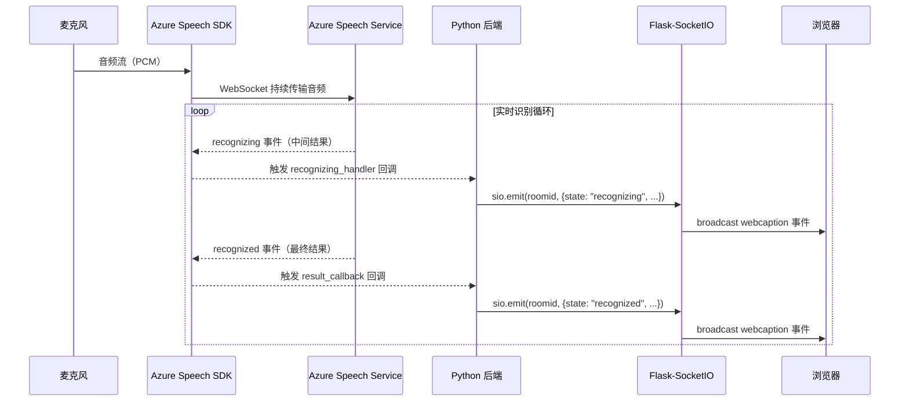
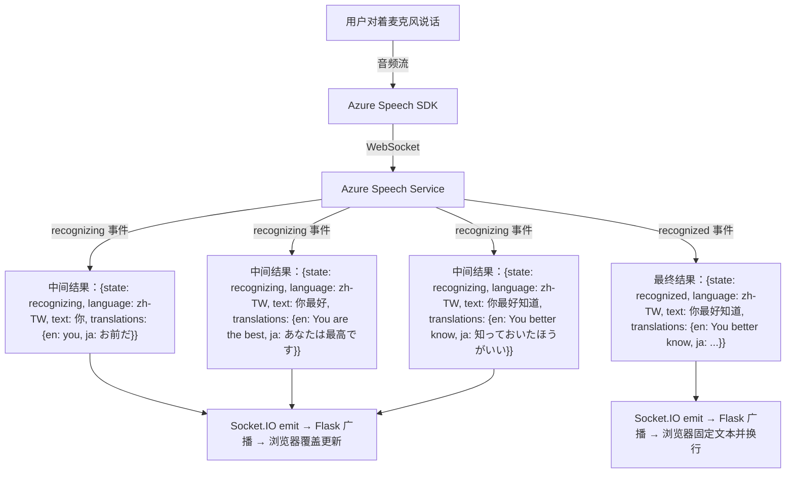
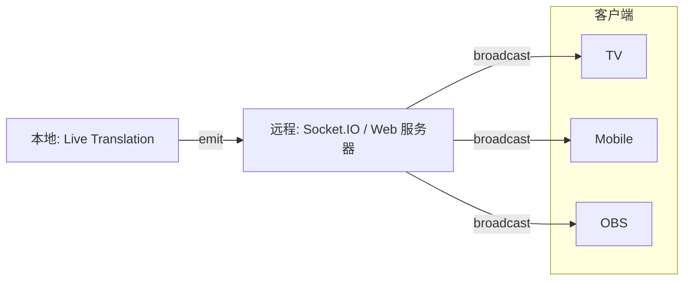

# Live Caption and Translation — 实时语音字幕与翻译系统

本项目基于 Azure Cognitive Services Speech SDK，实现了一套实时语音转录与多语言翻译系统。系统从麦克风捕获音频，通过 Azure 语音服务进行实时语音识别、语种自动检测和多语言翻译，并通过 WebSocket 将结果实时推送到浏览器前端展示。

## 目录

- [Azure 服务与 API 说明](#azure-服务与-api-说明)
- [系统架构总览](#系统架构总览)
- [核心实现原理](#核心实现原理)
  - [语音识别与翻译管线](#语音识别与翻译管线)
  - [实时纠错更新机制（Recognizing vs Recognized）](#实时纠错更新机制recognizing-vs-recognized)
  - [多语言自动检测](#多语言自动检测)
  - [实时通信机制](#实时通信机制)
- [数据流详解](#数据流详解)
- [前端展示模式](#前端展示模式)
- [项目文件结构](#项目文件结构)

---

## Azure 服务与 API 说明

### 使用的服务

本项目使用的是 **Azure AI Speech Service（语音服务）** 中的 **Speech Translation（语音翻译）** API。这是一个**一体化**的服务——ASR（语音识别）和翻译在同一个 API 调用中完成，而不是分两步先转文字再调翻译接口。

| 项目 | 说明 |
|------|------|
| **Azure 服务** | Azure AI Speech Service |
| **具体 API** | Speech Translation（语音翻译） |
| **SDK** | `azure-cognitiveservices-speech` (Python Speech SDK) |
| **协议** | WebSocket 长连接（`wss://`） |
| **端点** | `wss://{region}.stt.speech.microsoft.com/speech/universal/v2` |

### 为什么是 universal/v2 端点？

项目使用的是 `/speech/universal/v2` 端点，而非标准的翻译端点。这是因为系统启用了**连续语言识别（Continuous Language Identification）**功能——说话者可以在对话中随时切换语言，Azure 会自动检测。而这个功能目前**只有 v2 universal 端点支持**。

```python
# azure_translation.py 中的端点构建
endpoint_string = "wss://{}.stt.speech.microsoft.com/speech/universal/v2".format(region)
```

### 一体化 vs 两步式：架构选择

```
❌ 两步式方案（本项目未采用）:
   麦克风 → Azure Speech-to-Text API → 文本 → Azure Translator API → 翻译结果
   缺点：延迟翻倍，需要等 ASR 出完整句子才能翻译，两次网络往返

✅ 一体化方案（本项目采用）:
   麦克风 → Azure Speech Translation API → 同时输出识别文本 + 所有目标语言翻译
   优点：单次 WebSocket 连接，识别和翻译同步进行，延迟更低
```

在代码中，使用 `SpeechTranslationConfig` 配置翻译参数，通过 `TranslationRecognizer` 发起连续识别。Azure 服务在内部同时执行 ASR 和翻译，每次回调事件中同时返回原文和所有目标语言的翻译：

```python
# 配置翻译（azure_translation.py）
translation_config = speechsdk.translation.SpeechTranslationConfig(
    subscription=key,
    endpoint=endpoint_string,    # wss://...universal/v2
)

# 添加目标翻译语言
for lang in ["zh-Hant", "en", "ja"]:
    translation_config.add_target_language(lang)

# 创建翻译识别器（而非普通的 SpeechRecognizer）
recognizer = speechsdk.translation.TranslationRecognizer(
    translation_config=translation_config,
    audio_config=audio_config,
    auto_detect_source_language_config=auto_detect_source_language_config,
)
```

### 纯转录模式（不翻译）

当 `target_languages` 设置为空列表 `[]` 时，系统退化为**纯语音转录**模式，使用 `SpeechConfig` + `SpeechRecognizer` 代替翻译相关的类，仅输出识别文本，不做翻译：

```python
# main.py 中的判断逻辑
if len(config["target_languages"]) > 0:
    captioning.translation_continuous_with_lid_from_microphone()   # 翻译模式
else:
    captioning.transcription_continuous_with_lid_from_microphone() # 纯转录模式
```

### 需要的 Azure 资源

只需创建一个 **Azure AI Speech** 资源，获取两个值即可：

| 环境变量 | 说明 | 示例 |
|----------|------|------|
| `AZURE_SPEECH_KEY` | Speech 资源的订阅密钥 | `1a2b3c4d...` |
| `AZURE_SPEECH_REGION` | Speech 资源所在区域 | `eastasia`, `westus` |

---

## 系统架构总览

```
┌─────────────┐     WebSocket (wss)     ┌──────────────────────┐
│   麦克风     │ ──── 音频流 ──────────▸ │  Azure Speech Service │
│ (本地设备)   │                         │  语音识别 + 翻译       │
└─────────────┘                         └──────────┬───────────┘
                                                   │
                                          识别结果 + 翻译结果
                                           (回调事件)
                                                   │
                                                   ▾
                                        ┌─────────────────────┐
                                        │   Python 后端        │
                                        │   (azure_translation │
                                        │    .py)              │
                                        └──────────┬──────────┘
                                                   │
                                          Socket.IO emit
                                                   │
                                                   ▾
                              ┌──────────────────────────────────┐
                              │   Flask + Flask-SocketIO 服务器    │
                              │   (main.py, 端口 3002)            │
                              └──────┬──────┬──────┬─────────────┘
                                     │      │      │
                              broadcast 广播到所有客户端
                                     │      │      │
                                     ▾      ▾      ▾
                                  ┌─────┐┌──────┐┌─────┐
                                  │ OBS ││Mobile││ TV  │
                                  │模式  ││模式   ││模式  │
                                  └─────┘└──────┘└─────┘
```

---

## 核心实现原理

### 语音识别与翻译管线

系统使用 Azure Speech SDK 的**连续识别（Continuous Recognition）**模式，通过 WebSocket 长连接将本地麦克风音频流持续发送到 Azure 语音服务。



具体实现步骤：

1. **初始化翻译识别器**（`azure_translation.py`）：使用 `SpeechTranslationConfig` 配置 Azure 订阅密钥、区域和目标翻译语言，创建 `TranslationRecognizer` 实例。

2. **启动连续识别**：调用 `recognizer.start_continuous_recognition()`，SDK 在后台线程中持续捕获麦克风音频并发送到 Azure。

3. **事件驱动处理**：通过注册回调函数处理 Azure 返回的各种事件：
   - `recognizing` 事件 → `recognizing_handler()`：处理中间识别结果
   - `recognized` 事件 → `result_callback()`：处理最终确认结果

### 实时纠错更新机制（Recognizing vs Recognized）

这是系统最核心的实时体验设计。从日志中可以清楚看到这个过程：

```
RECOGNIZING zh-TW: 你                        ← 中间结果，随说随显
RECOGNIZING zh-TW: 你最好                     ← 追加新词，更新显示
RECOGNIZING zh-TW: 你最好知道                  ← 继续追加
RECOGNIZING zh-TW: 你最好知道不知道             ← 继续追加
RECOGNIZING zh-TW: 你最好知道不知道你就完蛋了    ← 继续追加 + 可能纠正前文
（最后触发 recognized 事件，输出最终确认结果）
```

```
┌─────────────────────────────────────────────────────┐
│              Azure Speech 识别过程                    │
│                                                     │
│  说话中... ──▸ recognizing ──▸ recognizing ──▸ ...   │
│                (中间结果)      (中间结果)              │
│                  不断覆盖前一次中间结果                 │
│                                                     │
│  停顿/语句结束 ──▸ recognized                        │
│                    (最终结果，固定不变)                 │
└─────────────────────────────────────────────────────┘
```

**后端处理（`azure_translation.py`）：**

- `recognizing_handler`：每次收到中间结果时，通过 Socket.IO 发送 `{state: "recognizing", text: ..., translations: {...}}`
- `result_callback`：当一句话最终确认后，发送 `{state: "recognized", text: ..., translations: {...}}`

**前端处理（以 `mobile.html` 为例）：**

```
收到 webcaption 事件
    │
    ├─ state == "recognizing"
    │   └─ 更新 #recognizing 元素的内容（覆盖式更新）
    │      每次中间结果都直接替换前一次，实现实时跟随效果
    │
    └─ state == "recognized"
        ├─ 创建新的 <div> 元素，写入最终确认文本
        ├─ 插入到 #recognizing 元素之前（成为历史记录）
        └─ 清空 #recognizing 元素（准备接收下一句）
```

这样用户看到的效果就是：正在说的话实时更新（可能会纠正前面的词），说完一句后文本固定下来，新的一句开始在下方实时显示。

### 多语言自动检测

系统使用 Azure Speech SDK 的**连续语言识别（Continuous Language Identification）**功能：

```python
# 设置语言识别模式为"连续"（而非默认的"仅开头检测"）
translation_config.set_property(
    property_id=speechsdk.PropertyId.SpeechServiceConnection_LanguageIdMode,
    value="Continuous",
)

# 指定候选语言列表
auto_detect_source_language_config = speechsdk.languageconfig.AutoDetectSourceLanguageConfig(
    languages=["en-US", "zh-TW", "ja-JP"]
)
```

这意味着说话者可以在对话中随时切换语言（例如从中文切到英文），Azure 会自动检测当前使用的语言并给出对应的识别结果和翻译。

### 实时通信机制

系统使用了两层 Socket.IO 通信：

```
┌─────────────────────────────────────────────────────────┐
│                    Socket.IO 通信架构                     │
│                                                         │
│  ┌──────────────┐    Socket.IO Client    ┌───────────┐  │
│  │ Captioning   │ ──── emit(roomid) ───▸ │  Flask     │  │
│  │ (子线程)      │                        │ SocketIO   │  │
│  └──────────────┘                        │  服务器     │  │
│                                          └─────┬─────┘  │
│                                                │        │
│  ┌──────────────┐                              │        │
│  │ @socketio.on │ ◂── 接收 roomid 事件 ────────┘        │
│  │ (roomid)     │                                       │
│  │              │ ──── emit("webcaption", broadcast) ──▸│
│  └──────────────┘                                       │
│                         │                               │
│                    广播到所有浏览器客户端                   │
│                    ┌────┴────┐                           │
│                    ▾         ▾                           │
│               ┌────────┐ ┌────────┐                     │
│               │Client 1│ │Client 2│                     │
│               └────────┘ └────────┘                     │
└─────────────────────────────────────────────────────────┘
```

1. **Captioning 子线程**作为 Socket.IO 客户端连接到本地 Flask 服务器
2. 每当 Azure 返回识别结果，子线程通过 `sio.emit(roomid, data)` 发送到服务器
3. Flask 服务器的 `@socketio.on(roomid)` 事件处理器接收数据
4. 通过 `emit("webcaption", data, broadcast=True)` 广播到所有连接的浏览器

使用 `roomid`（UUID）作为事件名称，确保不同实例之间互不干扰。

---

## 数据流详解

以用户说"你最好知道"为例，完整的数据流如下：



翻译结果的数据结构：

```json
{
    "state": "recognizing | recognized",
    "language": "zh-TW",
    "text": "你最好知道",
    "translations": {
        "zh-Hant": "你最好知道",
        "en": "You better know",
        "ja": "知っておいたほうがいい"
    }
}
```

---

## 前端展示模式

系统提供三种前端展示模式，适配不同使用场景：

| 模式 | URL 路径 | 适用场景 | 特点 |
|------|----------|----------|------|
| **OBS 模式** | `/` | 直播推流叠加字幕 | 透明背景，通过 URL 参数 `?language=original,en` 选择双语显示，覆盖式更新（不保留历史） |
| **Mobile 模式** | `/mobile` | 手机端观众查看字幕 | 下拉菜单切换语言，滚动显示历史记录，区分实时文本和已确认文本 |
| **TV 模式** | `/tv` | 大屏幕/电视展示 | 深色背景大字体，通过 URL 参数选择多语言同时显示，滚动显示历史 |

**OBS 模式的特殊处理：** 在 `index.html` 中，`recognized` 状态的消息会被直接忽略（`return`），只显示 `recognizing` 中间结果。这是因为 OBS 场景下字幕是覆盖式的，不需要保留历史——当前正在说的内容实时更新即可。

**Mobile/TV 模式的处理逻辑：** `recognizing` 状态更新当前正在显示的文本，`recognized` 状态将文本固定为历史记录并开始新的一行，实现类似聊天记录的滚动效果。

---

## 项目文件结构

```
live_translation/
├── main.py                  # 入口文件：Flask 服务器、Socket.IO 事件路由、启动语音识别线程
├── azure_translation.py     # 核心：Azure Speech SDK 语音识别/翻译，回调处理，Socket.IO 客户端
├── helper.py                # 工具函数：时间处理、控制台输出、文件读取回调
├── user_config_helper.py    # 配置解析：命令行参数解析、语言/模式配置
├── templates/
│   ├── index.html           # OBS 模式前端（双语叠加，覆盖更新）
│   ├── mobile.html          # Mobile 模式前端（语言切换，滚动历史）
│   └── tv.html              # TV 模式前端（大屏多语言，滚动历史）
├── static/
│   ├── style.css            # OBS 模式样式
│   ├── style_mobile.css     # Mobile 模式样式
│   └── style_tv.css         # TV 模式样式
├── pyproject.toml           # 项目依赖配置
└── .env.template            # 环境变量模板（Azure 密钥和区域）
```

### 两种运行模式

系统支持两种运行架构：

**1. 单机模式（默认）：** 服务器和语音识别运行在同一台机器上，浏览器直接连接本地服务。

```bash
uv run --env-file=.env python main.py
```

**2. 客户端-服务器模式：** 语音识别在本地运行，前端部署在外部服务器上，通过远程 Socket.IO 通信。

```bash
# 构建前端静态文件
uv run --env-file=.env python main.py --build

# 仅启动语音识别（不启动本地 Web 服务器）
uv run --env-file=.env python main.py --disable-server
```


